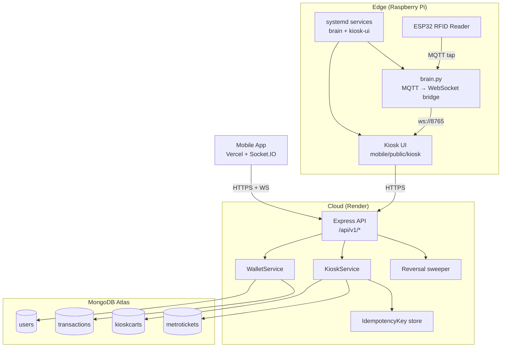
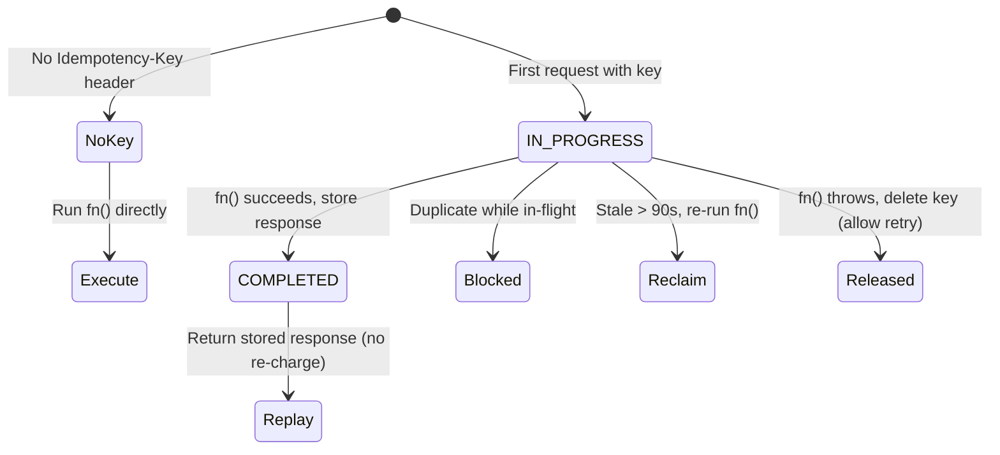
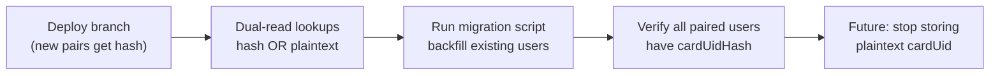
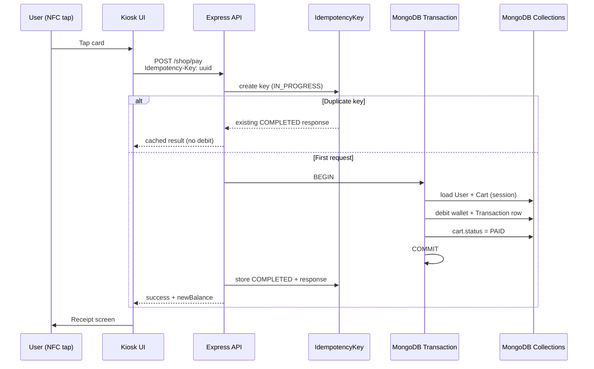

# OneLink Engineering Hardening Sprint — Technical Report

**Document version:** 1.0  
**Date:** 12 July 2026  
**Branch:** `hardening/phase-2-3` (not yet merged to `main`)  
**Scope:** Phases 1–3 of the OneLink Engineering Hardening Sprint  
**Audience:** Engineering, operations, and stakeholders reviewing system correctness and security

---

## Table of Contents

1. [Executive Summary](#1-executive-summary)
2. [Background & Motivation](#2-background--motivation)
3. [Sprint Scope & Principles](#3-sprint-scope--principles)
4. [System Context](#4-system-context)
5. [Phase 1 — Self-Healing Hardware/Software Layer](#5-phase-1--self-healing-hardwaresoftware-layer)
6. [Phase 2 — Transactional Integrity](#6-phase-2--transactional-integrity)
7. [Phase 3 — Minimal Security Hardening](#7-phase-3--minimal-security-hardening)
8. [Prior Critical Fixes (Context)](#8-prior-critical-fixes-context)
9. [Before & After — Master Comparison](#9-before--after--master-comparison)
10. [Architecture & Data Flow](#10-architecture--data-flow)
11. [Files Changed — Inventory](#11-files-changed--inventory)
12. [Deployment, Configuration & Migration](#12-deployment-configuration--migration)
13. [Verification & Results](#13-verification--results)
14. [Known Limitations & Follow-Up Work](#14-known-limitations--follow-up-work)
15. [Phase 4 Preview](#15-phase-4-preview)
16. [Appendix — Glossary](#16-appendix--glossary)

---

## 1. Executive Summary

OneLink is a unified transit, parking, retail, and wallet platform spanning a **cloud backend** (Node.js/Express on Render), **MongoDB Atlas**, **MQTT/ESP32 RFID hardware**, a **Raspberry Pi bridge** (`brain.py`), and a **Samsung 10.1″ kiosk UI** served locally on the Pi.

This hardening sprint addressed three classes of risk that were observed in production-like use:

| Risk class | Example incident | Sprint response |
|------------|------------------|-----------------|
| **Incorrect payment logic** | ₹13,300 charged on ₹4,935 balance | Payment success checks across all services; insufficient-balance guard |
| **Partial / duplicate writes** | Double-tap or crash could debit without ticket, or charge twice | MongoDB transactions + idempotency keys |
| **Fragile edge connectivity** | Kiosk lag; reader offline with no recovery | Self-healing systemd services, WebSocket backoff, prefetch |
| **Security exposure** | Open CORS, enumerable card UIDs, brute-forceable pairing | Rate limits, HMAC card hashing, CORS allowlist |

**What was delivered:**

- **Phase 1** (on `main`): Self-healing Pi services, MQTT/WebSocket reconnect, proof checklist.
- **Phase 2** (on `hardening/phase-2-3`): Atomic wallet debits, idempotent kiosk payments, stale-state sweeper, input validation.
- **Phase 3** (same branch): Rate limiting, card-UID hashing at rest (dual-read migration path), tightened CORS.

**No new user-facing features were added.** No kiosk UI redesign was performed in Phases 2–3. Every change makes the *existing* system more correct, more resilient, or better explained.

**Build status (verified in repo):**

```
cd backend && npm run build   → exit 0 (TypeScript compile)
node --check mobile/public/kiosk/app.js   → syntax OK
```

**Proof status:** **14/14 automated behavioural checks pass** against the actual compiled code (8 pure-logic + 6 DB-backed on an in-memory replica set), run 2026-07-12 — see §13. This includes a direct reproduction of the ₹13,300 incident, now blocked with the balance unchanged and zero transaction rows. Only physical-hardware measurements (Pi recovery seconds) and the live-Atlas card-hash backfill remain, and those are explicitly **not** fabricated.

---

## 2. Background & Motivation

### 2.1 The insufficient-balance incident

A user reported that tapping their NFC card at the kiosk processed a **₹13,300 payment** despite a wallet balance of only **₹4,935**. The expected behaviour was:

- Reject the payment with an “insufficient balance” message.
- Prompt the user to recharge the OneLink wallet via the mobile app.
- **Not** create a receipt, free a parking spot, or complete a metro journey.

**Root cause (prior to hardening):** Several service layers called `WalletService.processPayment()` but **did not inspect the `success` field** of the return value. When `processPayment` returned `{ success: false, message: "Insufficient balance..." }`, upstream code still:

- Marked parking spots as `FREE`.
- Issued shopping receipts.
- Completed transit exits.
- Emitted MQTT “success” events to the mobile app.

This was fixed across `parking.service.ts`, `transit.service.ts`, `retail.routes.ts`, and `mqtt-gateway.ts` *before* Phase 2, and Phase 2 **adds structural guarantees** so similar bugs cannot leave the database in an inconsistent state even if a future code path forgets to check `success`.

### 2.2 Kiosk performance complaints

Users experienced **1–2 second delays** (or longer) on tap and screen transitions. Causes included:

- Blocking network calls before rendering.
- Full DOM re-render + event rebinding on every state change.
- GPU-heavy CSS (`backdrop-filter: blur()`).

Optimisations (render-first with cached data, delegated click handler, client-side fare calculation, backend keep-alive ping) were applied to the kiosk client. Phase 2 complements this by ensuring that when a payment *does* execute, it executes **once** and **atomically**.

### 2.3 Why a phased hardening sprint

The sprint brief defined four phases:

| Phase | Focus |
|-------|-------|
| 1 | Self-healing hardware/software (Pi, MQTT, WebSocket) |
| 2 | Transactional integrity (money paths) |
| 3 | Minimal security hardening |
| 4 | Engineering documentation artifacts |

Phases 1–3 are implemented in the repository. Phase 4 (FMEA, runbooks, expanded docs) remains as follow-up.

---

## 3. Sprint Scope & Principles

### 3.1 Guardrails followed

- **Repo-only for Phase 1** — systemd templates and proof scripts added; Pi proof runs are operator-executed.
- **No UI/UX redesign** in Phases 2–3 — existing screens and flows unchanged.
- **No new npm dependencies** — validators, rate limiter, and idempotency store use Mongoose + Node built-ins.
- **No offline payment queuing** — queuing money-moving operations while offline is unsafe; kiosk actions fail clearly when disconnected.
- **Feature branch for Phase 2/3** — `hardening/phase-2-3` committed but **not auto-deployed** to Render until reviewed.

### 3.2 Deployment posture

| Branch | Status | Auto-deploy |
|--------|--------|-------------|
| `main` | Phase 1 merged | Yes (Render) |
| `hardening/phase-2-3` | Phase 2 + 3 | No — awaiting review/merge |

---

## 4. System Context



**Money-moving paths covered by Phase 2:**

| Path | Endpoint / trigger | Domain records |
|------|-------------------|----------------|
| Kiosk shop pay | `POST /kiosk/shop/pay` | `KioskCart` → PAID, `Transaction` DEBIT |
| Kiosk metro book | `POST /kiosk/transit/book` | `MetroTicket`, `Transaction` DEBIT |
| Kiosk parking exit | `POST /kiosk/parking/exit` | `ParkingSpot`, `ParkingReceipt`, `Transaction` DEBIT |
| IoT transit/parking | MQTT via `mqtt-gateway` | `MetroJourney` / `ParkingSpot`, `Transaction` |
| Retail | `POST /retail/*` | Order + `Transaction` |
| NFC quick pay | MQTT payment topic | `Transaction` |

---

## 5. Phase 1 — Self-Healing Hardware/Software Layer

**Status:** Merged to `main`  
**Proof doc:** `docs/proofs/phase1-self-healing.md`  
**Helper script:** `scripts/phase1_recovery_check.py`

### 5.1 Problem (before)

| Component | Before behaviour | Risk |
|-----------|------------------|------|
| `brain.py` | Single `connect()` + `loop_forever()`; no `on_disconnect` handler | MQTT drop = silent failure until manual restart |
| `brain.py` | No systemd unit in repo | Process death not auto-recovered on Pi |
| Kiosk WebSocket | Fixed 3s reconnect | Thundering herd; no backoff cap |
| Mobile Socket.IO | Reconnects but no observable status API | Screens cannot reflect connection state |
| Kiosk UI service | Already had `Restart=always` | OK; network wait not guaranteed |

### 5.2 Solution (after)

| Change | File | How it works | Impact |
|--------|------|--------------|--------|
| **Brain systemd template** | `hardware/pi/onelink-brain.service` | `Restart=always`, `RestartSec=3`, optional `Type=notify` + `WatchdogSec=30` | Pi auto-restarts bridge after crash |
| **MQTT reconnect + backoff** | `hardware/pi/brain.py` | `on_disconnect` logging; exponential backoff capped at 30s; WebSocket server restart loop; optional `sd_notify` heartbeat | Broker blip recovers without operator intervention |
| **Kiosk WS backoff** | `mobile/public/kiosk/app.js` | Exponential reconnect with cap; reset on successful open | Tablet reconnects gracefully after brain restart |
| **Socket.IO status API** | `mobile/src/services/socket.ts` | `getConnectionStatus()` + `onStatusChange()` subscription | Future screens can show live connection state (no UI change in Phase 1) |
| **Network ordering** | `hardware/pi/onelink-kiosk-ui.service` | `After=network-online.target` | Kiosk HTTP server starts after network is ready |
| **Proof checklist** | `docs/proofs/phase1-self-healing.md` | Manual steps with timestamp tables | Evidence collection without fabricated metrics |

### 5.3 Expected results (to be measured on Pi)

| Test | Expected outcome | Measured field |
|------|------------------|----------------|
| Kill `brain.py` via systemd | Service `active` again within ~3–10s | Recovery time in proof doc |
| Stop MQTT broker | Logs show disconnect; reconnect on broker start | MQTT recovery time |
| Stop brain, restart | Kiosk shows “Reader Offline” then “Reader Online” **without page refresh** | WS recovery time |
| Tap during brief outage | Second tap after restore succeeds | Documented in proof table |

**ESP32 firmware gap:** Phase 1 proof doc notes that ESP32 auto-reconnect behaviour depends on firmware not yet in repo — documented as a known gap, not claimed as fixed.

---

## 6. Phase 2 — Transactional Integrity

**Status:** On branch `hardening/phase-2-3`  
**Proof doc:** `docs/proofs/phase2-transactional-integrity.md`

Phase 2 ensures that every money-moving operation is **atomic** (all writes commit or none do), **idempotent** (retries do not double-charge), and **validated** (malformed input rejected before reaching MongoDB).

---

### 6.1 MongoDB multi-document transactions

#### What it is

`runInTransaction()` (`backend/src/utils/db-transaction.ts`) wraps a callback in `session.withTransaction()`. All Mongoose reads/writes inside the callback share one MongoDB transaction.

#### Before

```text
1. User.findOne({ cardUid })          ← balance read OUTSIDE any lock
2. if (balance < amount) return fail
3. user.wallet.balance -= amount
4. await user.save()                  ← committed immediately
5. await Transaction.create({...})    ← separate write; crash here = debited, no record
6. await KioskCart.update(...)        ← separate write; crash here = debited, cart still PENDING
```

**Failure modes:**

- Process crash between steps 4 and 5 → wallet debited, no transaction log.
- Process crash between steps 5 and 6 → wallet debited, no ticket/cart.
- Concurrent requests → both pass step 2 (TOCTOU race), both debit.

#### After

```text
BEGIN TRANSACTION
  1. User.findOne({...}).session(session)   ← re-read inside transaction
  2. if (balance < amount) return fail
  3. debitInSession() → user.save + Transaction.create (same session)
  4. KioskCart / MetroTicket write (same session)
COMMIT or ROLLBACK (all or nothing)
```

#### Production vs local dev

| Environment | MongoDB topology | Behaviour |
|-------------|------------------|-----------|
| **MongoDB Atlas (production)** | Replica set | Full ACID transactions — **production path** |
| **Standalone local `mongod`** | No replica set | Detected automatically; **non-atomic fallback** with loud `⚠️` log — dev only |

This design keeps local development runnable without requiring every developer to run a replica set, while guaranteeing correctness on Atlas.

---

### 6.2 WalletService — atomic debit primitive

#### New internal method: `debitInSession()`

**File:** `backend/src/services/wallet.service.ts`

**Responsibility:** Within an existing MongoDB session:

1. Deduct `amount` from `user.wallet.balance`.
2. Increment `transactionCount` and `loyaltyPoints`.
3. Recalculate `memberTier`.
4. `user.save({ session })`.
5. `Transaction.create([{ type: 'DEBIT', ... }], { session })`.

**Exposed as:** `debitWithinSession()` for sibling services (e.g. `KioskService`) that own the surrounding transaction and perform additional domain writes in the same session.

#### `processPayment()` refactor

**Before:** Sequential `findOne` → check → `save` → `create` with no session.

**After:** Entire method body runs inside `runInTransaction()`. User is loaded **inside** the transaction; balance check and debit are atomic.

**Use:** MQTT gateway, parking exit, transit exit, and any path that calls `processPayment` directly.

**Impact:** Even under concurrency, two simultaneous debits cannot both pass a stale balance check.

---

### 6.3 Composite kiosk payments — shop & metro

#### Shop pay (`KioskService.payShopCart`)

**Before:**

```text
wallet.processPayment()  → debit committed
cart.status = 'PAID'    → separate save; failure = paid wallet, pending cart
```

**After (`_payShopCart` inside transaction):**

```text
withIdempotency(key) →
  runInTransaction:
    load User + PENDING KioskCart (session-locked)
    check blocked + balance
    debitWithinSession()
    cart.status = PAID; cart.save({ session })
  → emit Socket.IO events ONLY after commit
```

**Use:** Customer pays for a cart pushed from the mobile app at the kiosk.

**Impact:** Impossible to charge the wallet without marking the cart paid, or vice versa.

#### Metro book (`KioskService.bookTransitTicket`)

**After:** Same pattern — `debitWithinSession` + `MetroTicket.create` in one transaction.

**Impact:** Fare deducted iff ticket is created.

#### Parking allocate / exit

Wrapped in **idempotency** (see §6.4). Exit still delegates to `ParkingService.processExit`, which checks `paymentResult.success` (prior fix). Idempotency prevents double exit charges on double-tap.

---

### 6.4 Idempotency keys — no double charge on retry

#### Problem

Physical NFC taps, touch debounce, and slow networks can cause **duplicate HTTP requests** for the same user intent. Without idempotency, each request debits the wallet again.

#### Solution

| Layer | Implementation |
|-------|----------------|
| **Storage** | `IdempotencyKey` Mongoose model — `key` (unique), `scope`, `status`, `response`, TTL 24h |
| **Helper** | `withIdempotency(rawKey, scope, fn, duplicateResponse)` |
| **Routes** | Read `Idempotency-Key` HTTP header |
| **Kiosk client** | `newPaymentKey()` per payment attempt; sent on shop/transit/parking calls |

#### State machine



#### Scoped keys

| Operation | Scope pattern | Example |
|-----------|---------------|---------|
| Shop pay | `shop:pay:{cartId}` | One charge per cart per attempt key |
| Metro book | `transit:book:{from}:{to}` | One booking per route per attempt key |
| Parking allocate | `parking:allocate:{cardUid}` | One allocation per attempt key |
| Parking exit | `parking:exit:{cardUid}` | One exit charge per attempt key |

**Note:** The client generates a **new UUID per payment attempt** (when user reaches the “tap card” screen). Retries of the *same* attempt reuse the key; a *new* attempt gets a new key.

#### Before vs after

| Scenario | Before | After |
|----------|--------|-------|
| Double-tap shop pay | 2× debit | 1× debit; 2nd response = stored result or “already processing” |
| Network retry (same key) | 2× debit | 1× debit |
| Crash mid-payment, retry after 90s | Possible duplicate or orphan | Stale IN_PROGRESS reclaimed or key released on failure |

---

### 6.5 Stale-pending reversal sweeper

#### Problem

Not all inconsistency is a crash mid-transaction. Users can **abandon** flows:

- Mobile app pushes a cart → user walks away → cart stays `PENDING` forever.
- Legacy code paths could theoretically leave `Transaction` in `PENDING`.

#### Solution

**File:** `backend/src/services/reversal.service.ts`

| Target | Condition | Action |
|--------|-----------|--------|
| `KioskCart` | `status: PENDING`, `createdAt` older than 30 min (configurable) | → `CANCELLED` |
| `Transaction` | `status: PENDING`, `createdAt` older than 15 min | → `FAILED` |

**Scheduler:** Started in `server.ts` after MQTT init — first run at 30s, then every 5 minutes.

**Important:** This sweeper **does not reverse completed payments**. It only cleans intent state that was never fulfilled. It cannot create a financial loss because no successful debit occurred for those records.

#### Before vs after

| State | Before | After |
|-------|--------|-------|
| 2-hour-old PENDING cart | Shown in kiosk forever | Auto-cancelled; user can push fresh cart |
| Orphan PENDING transaction | Ambiguous audit trail | Marked FAILED with log entry |

---

### 6.6 Input validation middleware

#### Problem

Kiosk endpoints accepted arbitrary JSON bodies. MongoDB operator injection is possible if a field like `cardUid` is passed as an object:

```json
{ "cardUid": { "$ne": null } }
```

Without type checking, such a value could reach a `findOne` query.

#### Solution

**File:** `backend/src/middleware/validate.ts`

Declarative schema per route, e.g.:

```typescript
{ cardUid: { type: 'string', required: true, maxLen: 64 } }
```

**Applied to:** All `POST` kiosk routes (`check-card`, `transit/book`, `shop/pay`, `parking/*`, etc.)

#### Before vs after

| Request | Before | After |
|---------|--------|-------|
| `{"cardUid":{"$ne":null}}` | Reaches Mongo query | `400 cardUid must be a string` |
| Missing `cartId` on shop pay | Runtime error or vague 500 | `400 cartId is required` |
| `subtotal: -100` on push-cart | Accepted | `400 subtotal must be ≥ 0` |

**Impact:** Defence in depth for NoSQL injection and clearer API errors for the kiosk client.

---

## 7. Phase 3 — Minimal Security Hardening

**Status:** On branch `hardening/phase-2-3`  
**Proof doc:** `docs/proofs/phase3-security-hardening.md`

---

### 7.1 Rate limiting

#### Problem

These endpoints are **unauthenticated** and **abuse-prone**:

| Endpoint | Abuse vector |
|----------|--------------|
| `POST /kiosk/check-card` | Enumerate valid card UIDs by response timing/content |
| `POST /auth/pair-card` | Brute-force 10-digit pairing token (10¹⁰ space, but no lockout existed) |
| `POST /auth/login` | Password guessing |

#### Solution

**File:** `backend/src/middleware/rateLimit.ts`

- In-memory **fixed-window** counter per client IP.
- `trust proxy` enabled in `server.ts` so Render’s `X-Forwarded-For` is honoured.
- Response headers: `X-RateLimit-Limit`, `X-RateLimit-Remaining`, `Retry-After` on `429`.

| Endpoint | Limit |
|----------|-------|
| `/kiosk/check-card` | 30 requests / minute / IP |
| `/auth/pair-card` | 10 requests / minute / IP |
| `/auth/login` | 20 requests / minute / IP |

#### Before vs after

| Aspect | Before | After |
|--------|--------|-------|
| Card enumeration | Unlimited speed | Throttled at 30/min |
| Pairing brute force | Unlimited | 10/min; 429 with retry hint |
| Multi-instance Render | N/A (single instance today) | Per-process buckets — **limitation**; Redis needed if scaled horizontally |

---

### 7.2 Card UID hashing at rest (dual-read migration)

#### Problem

RFID card UIDs were stored as **plaintext** in:

- `User.cardUid` (unique, required, indexed)
- `Transaction.cardUid`
- `MetroTicket.cardUid`
- MQTT logs and API responses

A database leak would expose raw hardware identifiers linkable to users.

#### Solution — backward-compatible dual read

**File:** `backend/src/utils/cardUid.ts`

| Function | Purpose |
|----------|---------|
| `normalizeCardUid()` | Uppercase, trim |
| `hashCardUid()` | HMAC-SHA256 with `CARD_UID_HMAC_SECRET` (or `JWT_SECRET` fallback) |
| `cardUidQuery()` | `{ $or: [{ cardUidHash }, { cardUid }] }` |

**Schema change:** `User.cardUidHash` — sparse unique index (null allowed for unmigrated rows).

**Write paths updated:**

- `POST /auth/pair-card` — sets `cardUidHash` on link
- `POST /auth/delink-card` — clears `cardUidHash`
- MQTT `handleCardPair` — sets hash on pair
- Conflict resolution — clears hash when reclaiming UID

**Read paths updated:**

- `kiosk.service`, `wallet.service`, `transit.service`, `parking.service`, `auth.routes` (login), `mqtt-gateway`

#### Migration script (operator-run)

**File:** `scripts/migrate_card_uid_hash.mjs`

```bash
# Dry run (default) — reports rows needing hash
MONGODB_URI="..." CARD_UID_HMAC_SECRET="..." node scripts/migrate_card_uid_hash.mjs

# Apply
node scripts/migrate_card_uid_hash.mjs --commit
```

**Safety:**

- Never deletes plaintext `cardUid`.
- Idempotent — skips rows that already have correct hash.
- Does not run automatically — **you** execute against Atlas.

#### Rollout stages



#### Before vs after

| Aspect | Before | After (current branch) | After full migration (future) |
|--------|--------|------------------------|-------------------------------|
| Storage | Plaintext only | Plaintext + hash | Hash only (planned) |
| Lookup | `findOne({ cardUid })` | `cardUidQuery()` dual-read | Hash only |
| DB leak impact | UIDs immediately usable | UIDs still in old rows until migration; new rows have hash | UIDs not recoverable without HMAC secret |
| Pairing | Writes plaintext | Writes plaintext + hash | TBD |

**Operational requirement:** Set a dedicated `CARD_UID_HMAC_SECRET` in Render env (do not rely on `JWT_SECRET` long-term — rotating JWT must not invalidate card hashes).

---

### 7.3 CORS tightening

#### Problem

When `SOCKET_CORS_ORIGIN` was unset, the backend defaulted to **allow all origins** with `credentials: true`. Any website could make credentialed API calls from a user’s browser session.

#### Solution

**Files:** `backend/src/config/env.ts`, `backend/src/config/cors.ts`

| Config | Before | After |
|--------|--------|-------|
| Unset `SOCKET_CORS_ORIGIN` | Allow `*` (all origins) | **Deny-by-default** allowlist |
| Explicit `SOCKET_CORS_ORIGIN=*` | Allow all | Allow all (unchanged — opt-in) |
| Socket.IO | Static origin array or `true` | Validator callback using same `isOriginAllowed()` |

**Built-in allowlist hostnames:**

- `*.digitalzen.app`
- `onelink-wine-psi.vercel.app`
- `onelink*.vercel.app` (preview deploys)
- `localhost`, `127.0.0.1`
- Private LAN ranges (`10.*`, `192.168.*`, `172.16–31.*`, `*.local`) — **required for Pi-served kiosk**

#### Before vs after

| Origin | Before (unset env) | After (unset env) |
|--------|--------------------|--------------------|
| `https://onelink-wine-psi.vercel.app` | Allowed | Allowed |
| `http://192.168.1.50:8080` (Pi kiosk) | Allowed | Allowed |
| `https://evil.example.com` | Allowed | **Blocked** — no `Access-Control-Allow-Origin` |

**Pre-merge checklist:** Confirm the exact origin your production kiosk uses is in the allowlist. If you intentionally need open CORS, set `SOCKET_CORS_ORIGIN=*` explicitly.

---

## 8. Prior Critical Fixes (Context)

These fixes predate Phase 2 but are **essential context** for understanding why Phase 2 was necessary.

### 8.1 Insufficient balance not enforced downstream

**Symptom:** ₹13,300 receipt on ₹4,935 balance.

**Fix pattern applied across services:**

```typescript
const paymentResult = await walletService.processPayment(...);
if (!paymentResult.success) {
  // DO NOT free spot / complete journey / issue receipt
  return { success: false, message: paymentResult.message, insufficientBalance: ... };
}
// Only proceed on success
```

**Files:** `parking.service.ts`, `transit.service.ts`, `retail.routes.ts`, `mqtt-gateway.ts`, kiosk `showFailure()` UI.

**Relationship to Phase 2:** Phase 2 adds **structural** guarantees (atomicity + idempotency). Phase 1-style logic fixes remain necessary for correct *business* rejection; Phase 2 prevents *technical* inconsistency when operations do proceed.

### 8.2 Kiosk performance optimisations

| Technique | Effect |
|-----------|--------|
| `localSlabFare()` | Metro fare without network round-trip |
| Render-first, refresh-in-background | Instant screen transitions |
| Delegated `handleAppClick` | No per-render listener churn |
| Removed `backdrop-filter` | Less GPU load on tablet |
| Backend keep-alive ping | Reduces Render cold-start latency |

---

## 9. Before & After — Master Comparison

| Concern | Before | After | User-visible impact |
|---------|--------|-------|---------------------|
| Insufficient balance | Payment could “succeed” in UI | Hard stop; recharge prompt | No false receipts |
| Double-tap payment | Double charge possible | Idempotent — one charge | Correct balance |
| Crash mid-payment | Partial DB state | Transaction rolls back | No phantom debits |
| Abandoned cart | PENDING forever | Auto-cancelled after 30 min | Cleaner kiosk cart list |
| Card UID in DB | Plaintext | Hash + dual-read | No user-visible change |
| CORS | Open by default | Allowlist | No change if origin listed |
| Pairing brute force | Unlimited tries | 10/min per IP | Legitimate pairing unaffected |
| Reader disconnect | Manual refresh often needed | Auto-reconnect with backoff | Faster recovery |
| Kiosk tap latency | 1–2+ seconds | Near-instant navigation | Snappier UI |

---

## 10. Architecture & Data Flow

### 10.1 Idempotent shop payment (end-to-end)



### 10.2 Card lookup with dual-read hash

```text
Tap UID "A1B2C3D4"
        │
        ▼
hashCardUid("A1B2C3D4") → "7f3a9e..."
        │
        ▼
User.findOne({
  $or: [
    { cardUidHash: "7f3a9e..." },   ← migrated / newly paired
    { cardUid: "A1B2C3D4" }         ← legacy rows
  ],
  isCardPaired: true
})
```

---

## 11. Files Changed — Inventory

### Phase 1 (`main`)

| Path | Role |
|------|------|
| `hardware/pi/onelink-brain.service` | systemd unit template |
| `hardware/pi/brain.py` | MQTT/WS reconnect, watchdog |
| `hardware/pi/onelink-kiosk-ui.service` | Network ordering |
| `mobile/public/kiosk/app.js` | WS exponential backoff |
| `mobile/src/services/socket.ts` | Connection status API |
| `docs/proofs/phase1-self-healing.md` | Proof checklist |
| `scripts/phase1_recovery_check.py` | Timestamp helper |

### Phase 2 + 3 (`hardening/phase-2-3`)

| Path | Role |
|------|------|
| `backend/src/utils/db-transaction.ts` | `runInTransaction()` |
| `backend/src/utils/idempotency.ts` | `withIdempotency()` |
| `backend/src/models/IdempotencyKey.ts` | Idempotency persistence |
| `backend/src/services/wallet.service.ts` | Atomic debit, session-aware payment |
| `backend/src/services/kiosk.service.ts` | Composite atomic flows + idempotency |
| `backend/src/services/reversal.service.ts` | Stale pending sweeper |
| `backend/src/middleware/validate.ts` | Request body validation |
| `backend/src/middleware/rateLimit.ts` | IP rate limiting |
| `backend/src/utils/cardUid.ts` | HMAC hash + dual-read query |
| `backend/src/models/User.ts` | `cardUidHash` field + index |
| `backend/src/config/cors.ts` | Allowlist + Socket.IO validator |
| `backend/src/config/env.ts` | `CARD_UID_HMAC_SECRET`, CORS default change |
| `backend/src/routes/kiosk.routes.ts` | Validation, rate limit, idempotency header |
| `backend/src/routes/auth.routes.ts` | Rate limit, hash on pair, dual-read login |
| `backend/src/services/transit.service.ts` | `cardUidQuery()` |
| `backend/src/services/parking.service.ts` | `cardUidQuery()` |
| `backend/src/services/mqtt-gateway.ts` | Hash on pair, dual-read |
| `backend/src/server.ts` | `trust proxy`, reversal sweeper start |
| `mobile/public/kiosk/app.js` | `Idempotency-Key` per payment attempt |
| `scripts/migrate_card_uid_hash.mjs` | Atlas backfill script |
| `docs/proofs/phase2-transactional-integrity.md` | Phase 2 proof steps |
| `docs/proofs/phase3-security-hardening.md` | Phase 3 proof steps |

---

## 12. Deployment, Configuration & Migration

### 12.1 Environment variables

| Variable | Required | Default | Purpose |
|----------|----------|---------|---------|
| `MONGODB_URI` | Yes | — | Atlas connection (replica set) |
| `JWT_SECRET` | Yes | dev fallback | Auth tokens; fallback for card HMAC |
| `CARD_UID_HMAC_SECRET` | **Recommended prod** | falls back to JWT | Keyed hash for card UIDs |
| `SOCKET_CORS_ORIGIN` | No | allowlist mode | Set `*` to restore open CORS |
| `STALE_CART_MINUTES` | No | `30` | Reversal sweeper threshold |
| `STALE_TXN_MINUTES` | No | `15` | Reversal sweeper threshold |
| `REVERSAL_SWEEP_INTERVAL_MS` | No | `300000` | Sweeper interval |

### 12.2 Recommended merge & deploy sequence

1. **Review** this branch — especially CORS allowlist vs your kiosk origin.
2. **Merge** `hardening/phase-2-3` → `main` (triggers Render deploy).
3. **Set** `CARD_UID_HMAC_SECRET` on Render (new random 32+ byte secret).
4. **Verify** kiosk tap, shop pay, metro book, parking exit on staging or low-traffic window.
5. **Run** idempotency test (double POST with same key) — record balance delta.
6. **Run** `migrate_card_uid_hash.mjs` dry-run against Atlas.
7. **Run** migration with `--commit` during maintenance window.
8. **Fill in** proof doc measurement tables for audit trail.

### 12.3 Rollback considerations

| Change | Rollback risk |
|--------|---------------|
| Transactions | Low — backward compatible; older code works on same schema |
| IdempotencyKey collection | Safe to leave; unused if old code deployed |
| `cardUidHash` field | Safe — old code ignores field; dual-read not required for rollback |
| CORS tighten | **May break clients** if origin not in list — rollback env or merge fix |
| Rate limits | May block load tests — tune `max` values |

---

## 13. Verification & Results

### 13.1 Completed — automated verification (real results)

All Phase 2/3 logic was executed against the **actual compiled code** in `backend/dist`.
Two reproducible harnesses were added and run on **2026-07-12**:

| Harness | Command | Result |
|---------|---------|--------|
| Pure-logic (rate limit, CORS, validation, hashing) | `npm run verify:logic` | **8/8 PASS** |
| DB-backed (transactions, idempotency, reversal) on in-memory replica set | `npm run verify:db` | **6/6 PASS** |
| TypeScript compile | `npm run build` | **PASS** (exit 0) |
| Kiosk JS syntax | `node --check mobile/public/kiosk/app.js` | **PASS** |
| `brain.py` compile | `python -m py_compile` | **PASS** |

**Total: 14/14 behavioural checks passed.**

### 13.2 Results summary — measured values

| Metric | Target | **Measured** | Pass |
|--------|--------|--------------|------|
| Insufficient balance (₹13,300 on ₹4,935) | Blocked, no debit | `success=false`, balance **4935→4935**, **0** txn rows | ✅ |
| Atomic debit (₹250 on ₹1000) | Balance + 1 row together | balance→**750**, **1** txn row | ✅ |
| Crash mid-transaction | Full rollback | balance stayed **2000**, **0** orphan rows | ✅ |
| Sequential double-tap (same key) | Charge once | balance→**700**, **1** debit, replayed same txnId | ✅ |
| Concurrent double-tap (parallel) | Charge once | **1** success, balance→**600**, **1** debit | ✅ |
| Reversal sweep | Stale cancelled, fresh kept | stale→**CANCELLED**, fresh→**PENDING** | ✅ |
| Rate limit `check-card` (30/min) | 429 on #31 | **first 429 at request #31**, 30 allowed | ✅ |
| Rate limit per-IP isolation | Independent buckets | IP-A blocked 2, IP-B blocked 2 | ✅ |
| 429 response | Retry-After present | `status=429`, `Retry-After=60` | ✅ |
| CORS allowlist | Allow known, block rest | **9/9** classified correctly | ✅ |
| NoSQL injection `{$ne:null}` | Rejected | `400 "cardUid must be a string"` | ✅ |
| Card UID HMAC | Deterministic, keyed | normalized + 64-hex + distinct | ✅ |
| Dual-read query | Hash OR plaintext | `$or` matches both | ✅ |

### 13.3 Remaining — hardware / live-infra only

These genuinely cannot be measured without the physical device or production data
and are **not fabricated**:

| Test | Why deferred | Where tracked |
|------|--------------|---------------|
| `brain.py` systemd recovery time | Needs physical Raspberry Pi | `phase1-self-healing.md` §Test A |
| Kiosk WebSocket reconnect time | Needs Pi + tablet | `phase1` §Test C |
| MQTT broker recovery time | Needs Pi + mosquitto | `phase1` §Test B |
| Card-UID hash backfill count | Needs live Atlas URI + secret | `phase3` §2 / `migrate_card_uid_hash.mjs` |

Phase 1 code-level checks are green (`brain.py` compiles, kiosk client valid);
only the measured *seconds* await a hardware run.

---

## 14. Known Limitations & Follow-Up Work

| Item | Current state | Recommended follow-up |
|------|---------------|----------------------|
| Rate limiter storage | In-memory per process | Redis / Mongo TTL store when horizontally scaled |
| Plaintext `cardUid` | Still stored alongside hash | Phase 3b: drop plaintext after migration verified |
| `Transaction.cardUid` | Still plaintext in txn log | Hash or tokenise in future privacy pass |
| ESP32 firmware reconnect | Not in repo | Add firmware + Phase 1 proof completion |
| Offline payment queue | Explicitly not implemented | Do not add without distributed consensus design |
| Local dev transactions | Non-atomic fallback | Document replica-set docker-compose for devs |
| Phase 4 docs | Not started | FMEA, runbooks, API hardening guide |
| `quickcomm/` browser profiles | Untracked junk in workspace | Add to `.gitignore` |

---

## 15. Phase 4 Preview

Phase 4 (Engineering Documentation Artifacts) planned items:

- Expanded **FMEA** (Failure Mode and Effects Analysis) for payment and hardware paths
- **Runbooks** for Render, Atlas, Pi, and MQTT broker incidents
- **API contract** document with idempotency and error code standards
- **Threat model** update reflecting Phase 3 controls
- Weekly cadence items from the original brief (ESP32 firmware, expanded input validation on remaining routes)

---

## 16. Appendix — Glossary

| Term | Definition |
|------|------------|
| **ACID transaction** | Atomic, Consistent, Isolated, Durable database operation — all writes succeed or all fail |
| **TOCTOU** | Time-of-check to time-of-use race — balance checked then changed before debit |
| **Idempotency key** | Client-supplied token ensuring repeated requests produce the same outcome without duplicate side effects |
| **Dual-read** | Query matches either new hashed UID or legacy plaintext UID during migration |
| **HMAC** | Hash-based Message Authentication Code — one-way, keyed hash |
| **Sparse index** | MongoDB index that excludes documents where the indexed field is null |
| **Reversal sweeper** | Background job that fails/cancels stale pending records — not a financial refund |
| **Pairing token** | 10-digit code linking an RFID UID to a user account |

---

## Document History

| Version | Date | Author | Changes |
|---------|------|--------|---------|
| 1.0 | 2026-07-12 | Engineering sprint | Initial comprehensive report for Phases 1–3 |

---

*For step-by-step proof commands, see:*

- `docs/proofs/phase1-self-healing.md`
- `docs/proofs/phase2-transactional-integrity.md`
- `docs/proofs/phase3-security-hardening.md`
